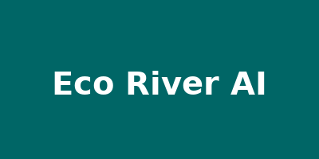
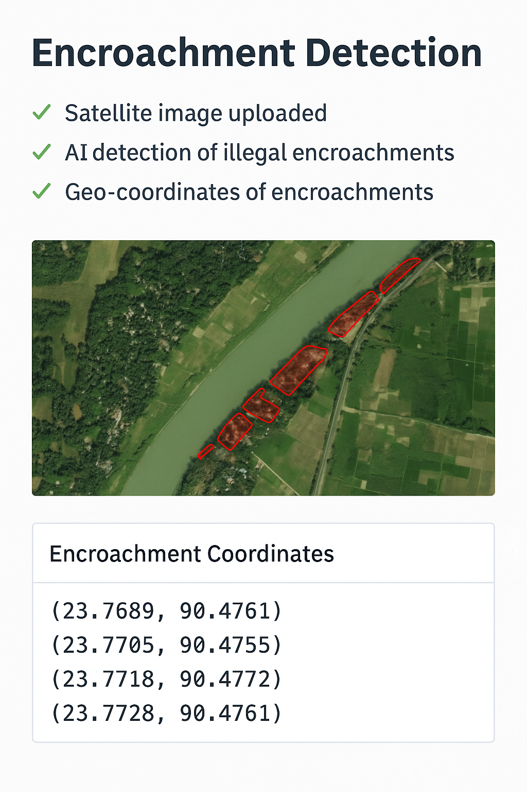

<p align="center">
  
</p>

<h1 align="center">EcoRiver AI – Intelligent River Protection System 🌊🇧🇩</h1>

<p align="center">
  <em>"Saving Every Drop, Protecting Every River."</em>
</p>

<p align="center">
  <a href="https://ecoriver-ai-ay5og92zfanrwxpcayfbti.streamlit.app/" target="_blank">
    🌐 Live Demo
  </a> |
  
  
  
</p>

---

## 🌟 About the Project

**EcoRiver AI** is a powerful, AI-driven web system developed for **WICE BD 2025** to automatically detect illegal river encroachments using satellite images and generate intelligent reports. It aims to support environmental protection, governmental monitoring, and public awareness for Bangladesh’s rivers.

---

## 🚀 Features

- ✅ Upload satellite images
- ✅ Detect illegal encroachments using AI
- ✅ Highlight riverbanks and boundaries
- ✅ Extract geo-coordinates of encroachments
- ✅ Generate PDF reports
- ✅ Real-time dashboard
- ✅ Historical river data & analytics
- ✅ Feedback & suggestion module
- ✅ AI model retraining module
- ✅ Alerts, warnings & visualization tools

---

## 🛠️ Tech Stack

- **Frontend**: Streamlit  
- **Backend**: Python, Flask  
- **AI/ML**: TensorFlow, PyTorch, Scikit-Learn  
- **Geo Tools**: GeoPandas, Folium, Shapely  
- **Data**: Pandas, NumPy  
- **Visualization**: Plotly, Matplotlib, Seaborn  
- **PDF Reports**: PyPDF2, fpdf  
- **Deployment**: GitHub + Streamlit Cloud

---

## 👥 Team Members

- **Mimtaj**
- **Tasfia Aminul Mimi**
- **Tanvir Ahmed Khan**

---

## 📸 Screenshots

### 🌍 Home Interface  


### 📍 Encroachment Detection  


---

## 📂 Installation

```bash
git clone https://github.com/jahanarya/eco_river_ai.git
cd eco_river_ai
pip install -r requirements.txt
streamlit run app.py
```

---

## 📁 Directory Structure (Sample)

```
eco_river_ai/
├── app.py
├── requirements.txt
├── README.md
├── logo.png
├── dashboard_screenshot.png
├── screenshots/
│   └── detection.png
├── models/
│   └── illegal_occupation_model.pkl
├── feature1_detect_illegal_occupation.py
├── feature2_monitor_river_width.py
├── ... (other feature files)
```

---

## 💬 Feedback & Contribution

Pull requests and suggestions are welcome! For major changes, please open an issue first to discuss what you would like to change.

---

## 📜 License

[MIT License](LICENSE)

---